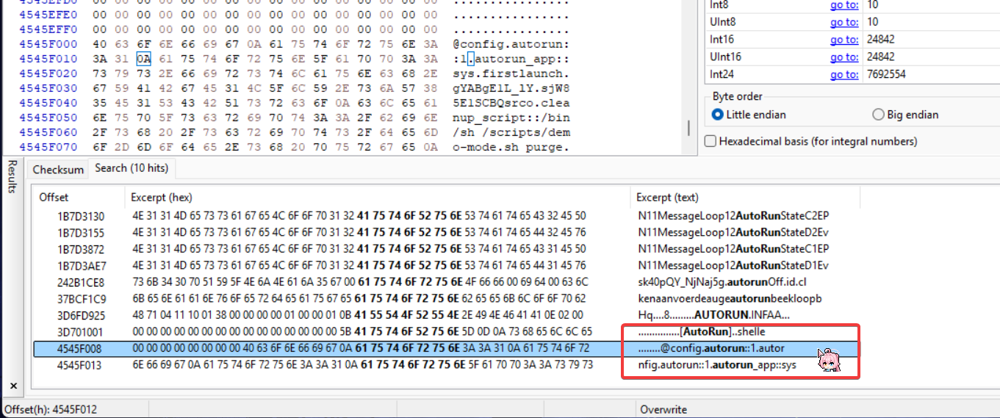

For enthusiasts and owners of legacy BlackBerry 10 devices or the BlackBerry PlayBook, the shutdown of BlackBerry's servers in 2022 presented a major problem. After a security wipe or factory reset, it became impossible to complete the initial setup, effectively turning these classic devices into paperweights.

This tutorial will guide you through modifying the device's firmware, allowing it to completely bypass the mandatory setup and boot directly to the home screen.

**Disclaimer:** This process involves modifying core operating system files. It is intended for advanced users. Proceed with caution and at your own risk. An incorrect step could potentially "brick" your device, rendering it unusable. I am not responsible for any damage to your device.

### What devices have been tested?

- BlackBerry PlayBook 3G/HSPA+ running 2.1.0.1917.
- BlackBerry Z30 running 10.3.3.3216 downgraded to [10.2.1.1057](https://web.archive.org/web/20131115133006/http://downloads-us.blackberry.com/upr/developers/downloads/Autoload-STA100-2-10.2.1.1057.exe) but stuck on the setup screen (bypassed by this tutorial).

### Before you start

You should be familiar with using a command prompt or PowerShell terminal. This tutorial assumes you know basic commands like `cd` and `dir`.

### You Will Need

- A good USB cable.
- The **Autoloader** file for your specific BlackBerry model.
- [**Sachesi:**](https://github.com/xsacha/Sachesi) A tool for extracting files from BlackBerry Autoloaders.
- [**bb10mt:**](https://bb10.root.sx/bb10mt.zip) BlackBerry 10 MultiTool.
- **A Hex Editor:** I used [HxD](https://mh-nexus.de/en/hxd/) for this tutorial.
- **DBBT (Darcy's BlackBerry Tools):** Used to create the final Autoloader.
- [**FerreiraPablo's cap.exe:**](https://github.com/FerreiraPablo/BlackberrySystemPacker/blob/main/cap.exe) A modified Autoloader that allows you to load unsigned QCFM files.

Let's get started.

### Step 1: Split the Autoloader

First, you need to extract the core OS and Radio files from the main Autoloader executable.

1. Place your device's Autoloader `.exe` file in a new folder.
2. Open Sachesi and navigate to the **Extract** tab.
3. Click "Extract Signed" and select your Autoloader file.
4. Sachesi will work for a few moments and then output two `.signed` files into the same folder: one for the OS (e.g., `filename@OS@IFS.signed`) and one for the Radio (e.g., `filename@Radio.signed`).


After you have extracted the files, you will have two `.signed` files in the same folder.


To make working with the files easier, I recommend renaming them to something more descriptive. I will rename them to `OS.signed` and `Radio.signed`.

### Step 2: Unpack the Core OS File

The `.signed` file containing the OS is a QCFM archive. We will use the `bb10mt` command-line tool to unpack it.

1. Open a Command Prompt or PowerShell terminal in the folder where you downloaded and extracted the `bb10mt.exe` file. You can open the terminal by holding down the Shift key and right-clicking in the folder, then selecting "Open PowerShell window here".
2. Run the following command. The `-c` flag tells the tool the path of the file you want to unpack.

```bash
bb10mt.exe unpack -c "path\to\your\OS.signed"
```

Replace `"path\to\your\OS.signed"` with the actual path to your OS file. For example:
`bb10mt.exe unpack -c C:\BlackBerry\OS.signed`


**Fact:** You can drop the files directly into the terminal window if you are using Windows Terminal.

After you have unpacked the files, you will have a folder with the following files:


We only care about the `.ufs` file.

### Step 3: Edit the Configuration File

This is the critical step where we disable the initial setup wizard.

Proceed carefully if you don't want to repeat this process multiple times.

1. Open your Hex Editor (I'm using [HxD](https://mh-nexus.de/en/hxd/)).

2. Find the file with the `.ufs` extension and then open it with the Hex Editor. You can drag and drop the file into the Hex Editor.

3. Press Ctrl+F, then search for the text string `autorun::1`.

    

    **For BlackBerry 10 devices:** Find the `autorun::1`.

    

    Then change it to `0`:

    

    **For BlackBerry PlayBook:** Find the `deactivate_mode::1` and `autorun::1`.

    

    Then change it to `0`, please note that there are two duplicate entries, you must change both of them:

    

4. Save the changes to the `.ufs` file and close the Hex Editor.

### Step 4: Pack the QCFM File

Now we must repack the modified files into a new `.signed` file.

1. Go back to your terminal window.
2. Enter the following command structure. Be very careful with the syntax.

    ```bash
    bb10mt.exe pack -c "path\for\output\modified_OS.signed" --input
    ```

3. After typing ` --input `, **do not press Enter yet**. Go to the folder containing your unpacked files (the one with the modified `.ufs`).
4. Select and drag the following four files onto your terminal window:
    - The file ending in `.ufs`
    - The file ending in `.ifs`
    - The file ending in `.mbr`
    - The file ending in `.rcfs`
5. The terminal will populate the paths. **You must manually insert a comma (,) between each file path.**
6. **Important:** Make sure to ignore any `.sig` or `.sig2` files. Your final command should look something like this:

    ```bash
    bb10mt.exe pack -c C:\BlackBerry\Patched_OS.signed --input C:\BlackBerry\unpacked\OS.ufs,C:\BlackBerry\unpacked\OS.ifs,C:\BlackBerry\unpacked\OS.mbr,C:\BlackBerry\unpacked\OS.rcfs
    ```

7. Press Enter. `bb10mt` will now create a new, patched `OS.signed` file at the output path you specified.


### Step 5: Create the Final Autoloader

With your patched OS file ready, the final step is to build a new Autoloader `.exe`.

1. Open **DBBT (Darcy's BlackBerry Tools)**. Remember to first replace its bundled `cap.exe` with the modified one from FerreiraPablo. That file should be in the same folder as the `DBBTool.exe` file.
2. In the "Build Autoloader" tab, select your newly created **patched OS `.signed` file** and the original **Radio `.signed` file** that Sachesi created in Step 1 (if your device requires one) by clicking **...** button.
3. Enter the name of the new Autoloader file.
4. Click the "Build it!" button.
5. DBBT will combine the files and create a new, fully functional Autoloader `.exe` in the same folder.

### Flashing Your Device

You now have a custom Autoloader that will bypass the setup screen.

1. Turn off your BlackBerry device.
2. Connect it to your computer via USB. As soon as you connect it, the device's LED should turn green, indicating it is in bootloader/fastboot mode.
3. Run the new Autoloader `.exe` you just created.
4. A command window will appear and the flashing process will begin. Do not unplug the device.
5. Once complete, your device will reboot automatically and load directly into the home screen, completely skipping the initial setup.

Congratulations! You have successfully revived your BlackBerry device. Happy hacking!
