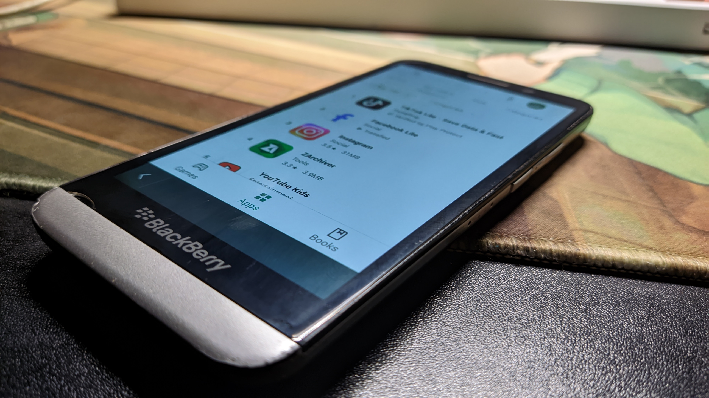
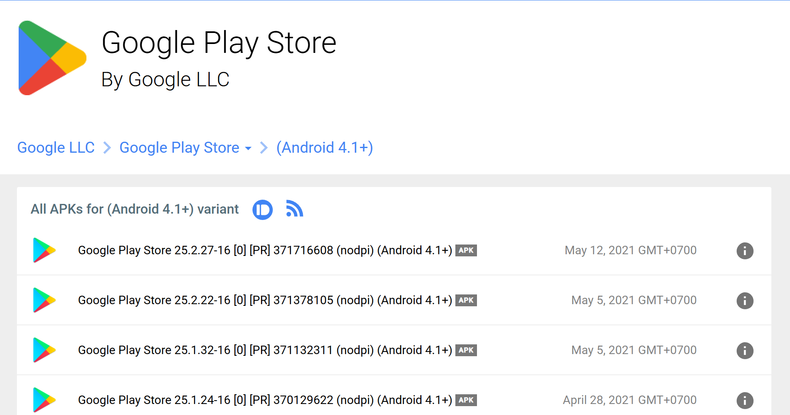
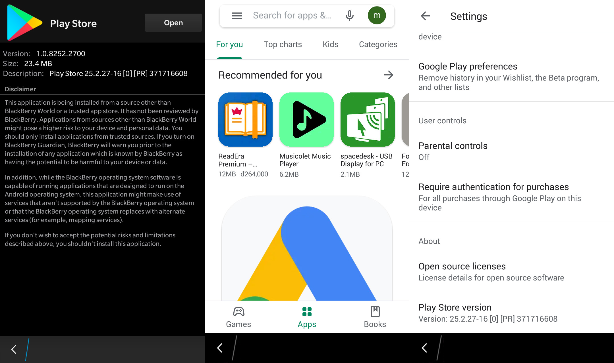

I recently got my hands on an old BlackBerry Z30 for just ~$8 USD, quite a deal considering its 2013 specs. That 720p Super AMOLED display, Qualcomm Snapdragon S4 Pro, 16 GB of storage, and 2 GB of RAM were top-tier back in the day.

Unfortunately, it's permanently stuck with Android Runtime 4.3 (API Level 18), which hasn't been updated since BB10.0's initial release. Finding apps or even a compatible version of the Google Play Store is extremely difficult nowadays.

While searching for a solution, I found that [cobalt's patches](https://cobalt232.github.io/playstore/) still work perfectly.

Just follow the steps in the [cobalt's How to Install guide](https://cobalt232.github.io/playstore/#how-to-install) and you'll be good to go. Important: Do not install cobalt's patched Play Store itself. Once that's done, the next step is to find the latest Google Play Store compatible with Android 4.3.

To do this, I used [APKMirror](https://www.apkmirror.com/) to find the APKs.

The latest version of the Google Play Store I could find for Android 4.3 is `25.2.27-16` since [Google has dropped support for Android 4.3 since 2021](https://android-developers.googleblog.com/2021/07/google-play-services-discontinuing-jelly-bean.html). You can browse other versions for Android 4.3 via the link below:

```text
https://www.apkmirror.com/apk/google-inc/google-play-store/variant-%7B%22minapi_slug%22:%22minapi-16%22%7D/
```



To search for another Android version, simply change `minapi-16` in the URL to the desired API level.

I tried looking for API Levels 17 (Android 4.2) and 18 (Android 4.3) all the way up to the latest version but couldn't find archived versions beyond that.

Once you've found a compatible APK, download and install it on your BlackBerry 10 device. The first time you launch the Play Store, it may take a while to load. If it says "Play Store is not responding" just tap **Wait** and give it some time.

And that's it, you can now install apps from the Google Play Store!



### Known Issues

Some apps may not install properly. For example, **TikTok Lite** gets stuck in the *Installing* state and never completes.

Thanks for reading! Happy hacking :)
